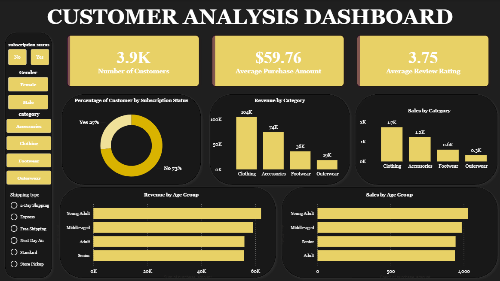

# 🛍️ Customer Shopping Behavior Analysis

An end-to-end data analysis project that takes a raw customer shopping dataset through **Python (cleaning & EDA) → PostgreSQL (SQL analysis) → Power BI (dashboard)**, answering 10 real business questions about revenue, discounts, customer loyalty, and shipping preferences.

---

## 📌 Project Overview

This project analyzes shopping behavior for **3,900 customers** across categories like Clothing, Footwear, Outerwear, and Accessories. The goal was to simulate a real analyst workflow — starting from a messy CSV, cleaning and transforming it in Python, loading it into a relational database for SQL-based business analysis, and finally visualizing the findings in an interactive Power BI dashboard.

**Workflow:**
```
customer_shopping_behavior.csv
        ↓
Python / Pandas (cleaning, feature engineering)
        ↓
PostgreSQL (business-question SQL queries)
        ↓
Power BI (interactive dashboard)
```

---

## 🗂️ Repository Structure

| File | Description |
|---|---|
| `customer_shopping_behavior.csv` | Raw dataset (3,900 rows, 18 columns) |
| `customer_shopping_behaviour.ipynb` | Data cleaning, feature engineering, and PostgreSQL load |
| `customer_behaviour.sql` | 10 SQL queries answering key business questions |
| `customer_analysis_dashboard.pbix` | Power BI dashboard built on the cleaned data |

---

## 🧹 Data Cleaning & Feature Engineering (Python)

- Filled missing `review_rating` values using the **median rating per category**
- Standardized column names (lowercase, underscores)
- Engineered `age_group` — customers binned into **Young Adult / Adult / Middle-aged / Senior** quartiles
- Engineered `purchase_frequency_days` from the `frequency_of_purchases` text field (e.g. Weekly → 7, Monthly → 30)
- Identified that `discount_applied` and `promo_code_used` were fully redundant and dropped the duplicate column
- Loaded the cleaned dataset into PostgreSQL via SQLAlchemy for SQL-based analysis

---

## 🔍 Key Business Questions & Insights (SQL)

| # | Question | Insight |
|---|---|---|
| 1 | Revenue: Male vs Female | Male customers generated **$157,890** vs Female's **$75,191** — nearly 2x more, likely reflecting a larger share of male shoppers in the dataset |
| 2 | Customers who used a discount but still spent above average (avg = $59.76) | **839 customers** |
| 3 | Top 5 highest-rated products | Gloves (3.86), Sandals (3.84), Boots (3.82), Hat (3.80), Handbag (3.78) |
| 4 | Standard vs Express shipping — avg spend | Express: **$60.48** vs Standard: **$58.46** — express customers spend slightly more |
| 5 | Do subscribers spend more? | Non-subscribers actually average slightly higher ($59.87 vs $59.49) and drive **$170,436** of total revenue vs $62,645 from subscribers — subscription status alone isn't a strong spend predictor |
| 6 | Top 5 products by discount usage rate | Hat (50%), Sneakers (49.7%), Coat (49.1%), Sweater (48.2%), Pants (47.4%) |
| 7 | Customer segmentation (New / Returning / Loyal) | Loyal: **3,116**, Returning: **701**, New: **83** — the base is overwhelmingly repeat/loyal customers |
| 8 | Top 3 products per category | See dashboard / SQL file for full breakdown by category |
| 9 | Are repeat buyers (5+ purchases) more likely to subscribe? | No — of repeat buyers, **2,518 are non-subscribers** vs only 958 subscribers, suggesting subscription isn't tied to purchase frequency |
| 10 | Revenue by age group | Young Adult ($62,143) > Middle-aged ($59,197) > Adult ($55,978) > Senior ($55,763) — fairly evenly spread, with Young Adults slightly leading |

*Total revenue across all customers: **$233,081***

---

## 📊 Power BI Dashboard

The dashboard visualizes revenue trends, customer segments, discount behavior, and category-level performance interactively.



The dashboard includes:
- **Top KPIs**: 3.9K total customers, $59.76 average purchase amount, 3.75 average review rating
- **Subscription status breakdown**: 73% non-subscribers vs 27% subscribers
- **Revenue & sales by category**: Clothing leads at $104K revenue / 1.7K sales, followed by Accessories, Footwear, and Outerwear
- **Revenue & sales by age group**: Young Adults lead in both revenue (~$60K) and sales volume (~1,000 units)
- **Interactive filters**: subscription status, gender, category, and shipping type slicers

---

## 🛠️ Tech Stack

- **Python** (Pandas) — data cleaning & feature engineering
- **PostgreSQL** — relational database & SQL analysis
- **SQLAlchemy / psycopg2** — Python-to-PostgreSQL connection
- **Power BI** — interactive dashboard & visualization
- **Jupyter Notebook** — analysis environment

---

## 🚀 How to Reproduce

1. Clone this repo
2. Set up a PostgreSQL database and update your connection credentials as **environment variables** (do not hardcode them)
3. Run `customer_shopping_behaviour.ipynb` to clean the data and load it into PostgreSQL
4. Run the queries in `customer_behaviour.sql` against the loaded table
5. Open `customer_analysis_dashboard.pbix` in Power BI Desktop to explore the dashboard

---

## 💡 Skills Demonstrated

- Data cleaning & feature engineering with Pandas
- Writing analytical SQL (aggregations, window functions, CTEs, subqueries)
- Python-to-database integration (SQLAlchemy)
- Business-question-driven analysis
- Dashboard design in Power BI

---

## 👤 Author

**Sanjana S**
📍 Bengaluru, India
